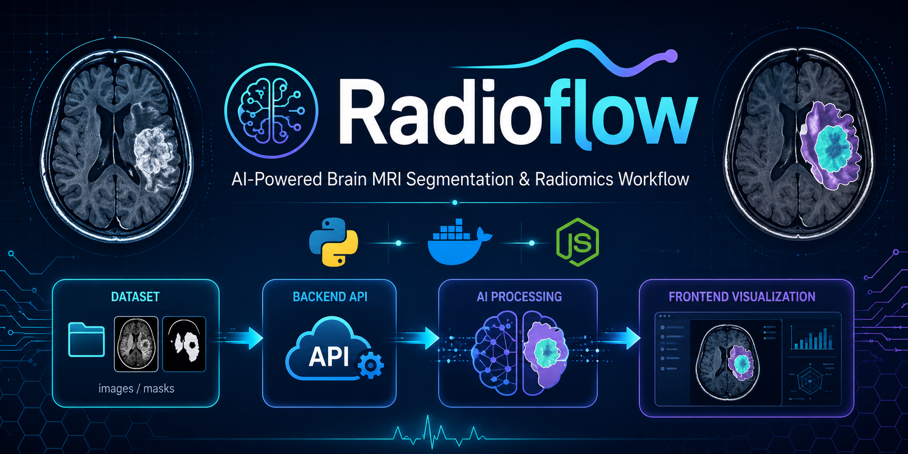
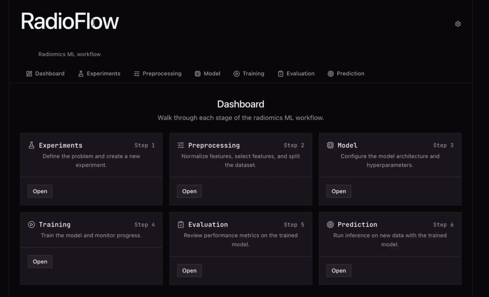
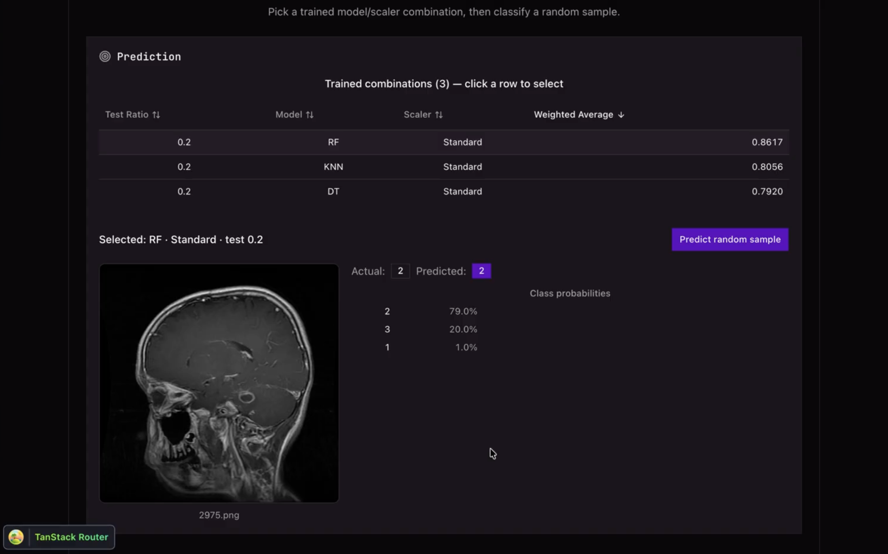

# Radioflow

Radioflow is an open-source radiomics imaging training and prediction pipeline that turns segmented medical images into quantitative features, compares classification approaches, and runs inspectable sample-level predictions. It gives researchers and learners one end-to-end workflow for exploring how image-derived features can support model evaluation and classification without assembling the full pipeline from scratch.

> Originally prepared as University of Louisville BE645 AI in Radiomics Final Project







## Classification and Prediction Data

Radioflow derives structured data at three levels: configurable first-order, GLCM, GLRLM, and GLSZM radiomic features from each image and mask; evaluation data for each trained classifier; and prediction data for individual samples. Results can be reviewed in the web interface or consumed from the generated files and API responses.

### Classification experiments

Training runs a configurable sweep across test ratios, feature scalers, and classification models. The built-in configuration supports test ratios of 0.10, 0.15, 0.20, 0.25, and 0.30; Normalizer, Standard, MinMax, Robust, MaxAbs, and Quantile Transformer scalers; and the following classifiers:

- Multi-layer perceptron, random forest, AdaBoost, k-nearest neighbors, decision tree, extra trees, and stochastic gradient descent
- Support vector classifier, Gaussian naive Bayes, logistic regression, gradient boosting, bagging, XGBoost, LightGBM, voting, and stacking classifiers

Each model/scaler/test-ratio combination produces:

| Data or artifact | What can be derived |
| --- | --- |
| Experiment identity | The model, scaler, and held-out test ratio used for the run |
| Per-class counts | True positives, false positives, false negatives, and true negatives, ordered by the class labels in the confusion matrix |
| Aggregate performance | Precision, recall, F1, accuracy, and specificity using macro, micro, and class-frequency-weighted aggregation |
| Summary scores | Macro, micro, and weighted averages, each calculated as the arithmetic mean of that aggregation's precision, recall, F1, accuracy, and specificity |
| Confusion matrix | Raw class labels and counts for programmatic use, plus a rendered PNG for visual review |
| Reusable training objects | A serialized fitted classifier, fitted scaler, label encoder, and the feature-column names used for training |

The evaluation UI makes these combinations sortable and selects the highest weighted F1 score by default. The underlying API returns one evaluation row per combination, while the generated output directory contains one `Metrics History.csv` per test ratio and model-specific confusion-matrix and pickle files:

```text
<RESULTS_DIR>/<experiment-id>/training/
└── TestRatio_<ratio>/
    ├── Metrics History.csv
    ├── <model>_<scaler>_CM.json
    ├── <model>_<scaler>_CM.png
    └── <model>_<scaler>.p
```

### Sample-level predictions

After training, consumers can choose any completed model/scaler/test-ratio combination and classify a randomly selected row from the experiment's extracted-features CSV. A prediction response provides:

- The sampled row index and, when present, its source filename and image path
- The ground-truth class and predicted class, enabling an immediate correctness comparison
- A probability for every class when the selected classifier implements `predict_proba`; otherwise probabilities are returned as `null`
- The dataset identifier needed to retrieve and display the associated source image

Prediction uses the same fitted scaler and label encoder saved during training, so returned class names are decoded to the labels in the source data. The current prediction endpoint samples from the existing labeled feature dataset; it does not yet accept an arbitrary new image or feature row. Evaluation is based on a stratified random holdout, and each trained combination currently receives its own random split, so results should be treated as exploratory comparisons rather than deterministic or clinical-performance claims.

## Requirements
- Python 3.10
- uv
- Node.js version 24+
- Docker Desktop

## Getting Started

### Linking Your Local Dataset
It is assumed that you have a local dataset in a director with the two following subdirectories:
- images
- masks

> **Note:** Ensure you grant Docker Desktop access to the directory on your machine.

**MacOS**:
1. Open Docker Desktop
2. Go to Settings > Resources > File Sharing
3. Click "Add a Folder" and select the directory where you have stored the dataset
4. Click "Apply & Restart" to save the changes and restart Docker Desktop

**Windows WSL2**:
1. Open Docker Desktop
2. Go to Settings > Resources > WSL Integration
3. Add the drive letter where you have the Dataset
4. Click "Apply & Restart" to save the changes and restart Docker Desktop

Next, you need to update the `DATASET_PATH` variable in the `.env` file at the root of the repo to point to the directory where you have stored the Dataset. For example:
```bash
cp .env.example .env
```

Then edit `.env` and set:
```
DATASET_PATH=/path/to/dataset
```

### Start the Backend API
1. Navigate to the root of the repo:
    ```bash
    cd Radioflow
    ```
2. Build and run the Docker container:
    ```bash
    docker compose up --build -d backend
    ```
3. Confirm the container is running:
    ```bash
    docker compose ps
    ```
4. Check the API health endpoint:
    ```bash
    curl http://localhost:8000/health
    ``` 

### Starting the Backend API (image already built)
If you've already built the backend image and just need to start it again (no code changes since the last build), skip the `--build` step:
1. Navigate to the root of the repo:
    ```bash
    cd Radioflow
    ```
2. Start the existing container:
    ```bash
    docker compose up -d backend
    ```
3. Confirm the container is running:
    ```bash
    docker compose ps
    ```
4. Check the API health endpoint:
    ```bash
    curl http://localhost:8000/health
    ```

> **Tip:** If the container already exists but is stopped, `docker compose up -d backend` will just restart it without rebuilding. Only add `--build` back if you've changed backend code or dependencies.

### Stopping the Backend API
To stop the backend API, run:
```bash
docker compose down backend
```

### View API Documentation
View API documentation at:
- http://localhost:8000/docs (Swagger UI)
- http://localhost:8000/redoc (ReDoc)

## Starting the Frontend
1. cd into the frontend directory:
    ```bash
    cd frontend
    ```
2. `npm install` to install dependencies
3. `npm run dev` to start the development server
4. Open http://localhost:5173 in your browser to view the app

## Licensing and Attribution

The example dataset used for this project is sourced from Figshare as the [Brain Tumor Dataset](https://figshare.com/articles/dataset/brain_tumor_dataset/1512427). 

https://doi.org/10.6084/m9.figshare.1512427

Version: 8

```bibtex
@article{Cheng2017,
    author = "Jun Cheng",
    title = "{brain tumor dataset}",
    year = "2017",
    month = "4",
    url = "https://figshare.com/articles/dataset/brain_tumor_dataset/1512427",
    doi = "10.6084/m9.figshare.1512427.v8"
}
```

All credit and rights to the dataset are owned by the original authors, and it is used here solely for educational purposes in the context of this project. The dataset includes 3,064 T1-weighted contrast-enhanced MRI images from 233 patients, categorized into three types of brain tumors: meningioma (708 slices), glioma (1,426 slices), and pituitary tumor (930 slices).

The core Python code implementation have been sourced from Hossam Balaha and their curriculum development in the [BE 645 Artificial Intelligence (AI) and Radiomics](https://github.com/HossamBalaha/BE-645-Artificial-Intelligence-and-Radiomics) course. All original source code is the sole property of [Hossam Balaha](https://github.com/HossamBalaha) and the University of Louisville. Express written consent has been granted from original authors to use the code in this project. The code has been adapted and extended for use in Radioflow, but the original contributions are acknowledged. As cited from the original repository:


> No part of this series may be reproduced, distributed, or transmitted in any form or by any means, including photocopying, recording, or other electronic or mechanical methods, without the prior written permission of the author, except in the case of brief quotations embodied in critical reviews and certain other noncommercial uses permitted by copyright law. For permission requests, contact the author.
